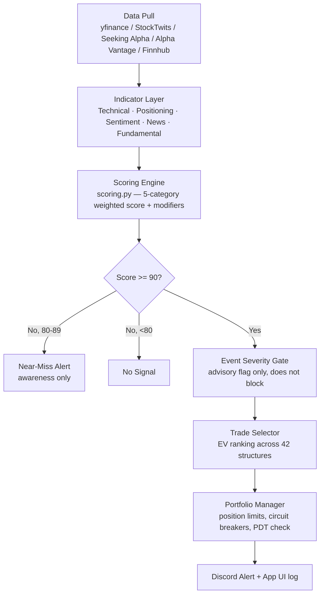

# StockAnalysis — Current Project Overview

**A single, current snapshot of the whole workspace — what it is, how it works, what's built, and where it stands today.**
For the full historical design rationale and every implementation detail, see `Project_Scope.md` (the living spec this document summarizes). For the desktop app plan, see `App_UI_Scope.md`. For a version-by-version history, see `CHANGELOG.md`.

*Last reviewed: 2026-07-19, model v2.2.10 — includes the first real backtest result, several backtest-methodology fixes and self-corrections, a rate-regime investigation, the infrastructure to run a second sector, a same-day correction to that infrastructure (a claimed fix was incomplete), and now activation of the second sector for paper trading (not live capital) plus the app UI work needed to actually see it. See §11.*

---

## Table of Contents

1. [At a Glance](#1-at-a-glance)
2. [What This Is (and Isn't)](#2-what-this-is-and-isnt)
3. [How It Works](#3-how-it-works)
4. [The Scoring Model](#4-the-scoring-model)
5. [Trade Selection](#5-trade-selection)
6. [Safety & Risk Systems](#6-safety--risk-systems)
7. [Project Structure](#7-project-structure)
8. [Tech Stack & External APIs](#8-tech-stack--external-apis)
9. [Build Status by Phase](#9-build-status-by-phase)
10. [Testing](#10-testing)
11. [Where Things Actually Stand Right Now](#11-where-things-actually-stand-right-now)
12. [Desktop App (In Progress)](#12-desktop-app-in-progress)
13. [Known Gaps & Open Items](#13-known-gaps--open-items)
14. [What's Next](#14-whats-next)
15. [How to Run It](#15-how-to-run-it)

---

## 1. At a Glance

| | |
|---|---|
| **Purpose** | Decision-support system that finds high-conviction swing trades in semiconductor stocks and recommends them — it does not trade automatically |
| **Watchlist** | NVDA, AMD, AVGO, TSM, MU, ASML (benchmark: SMH sector ETF) |
| **Holding period** | 5–15 trading days |
| **Starting capital (paper only)** | $15,000 |
| **Current model version** | v2.2.10 (see `CHANGELOG.md`) |
| **Watchlist** | 11 tickers, two sectors, both **paper-trading only**: semiconductors (NVDA/AMD/AVGO/TSM/MU/ASML vs. SMH) + regional banks (ZION/KEY/HBAN/RF/FITB vs. KRE, activated v2.2.10) |
| **Live-trading status** | ❌ **Not eligible.** No version has ever passed the official fixed-slice backtest — as of v2.2.17 the blocking reasons are trade-count shortfall (100 required, 18 observed on the fixed slice) and Sharpe (1.0 required, 0.34 observed), not expectancy: the bootstrapped 95% CI lower bound on per-trade R-expectancy (0.42R) actually clears the new 0.3R gate. Zero real money at risk regardless of which sectors are active for paper trading. |
| **Current phase** | Paper trading (running, 0 qualifying signals so far) + post-review code hardening |
| **Test suite** | 539 tests: 536 pass, 3 skipped — the skips are stale, leaving stress testing with zero real coverage (see §10) |
| **Delivery channel** | Discord webhook (sole channel — email/SMS were removed in v2.2.1) |

---

## 2. What This Is (and Isn't)

**It is:** a rules-based, statistically-grounded scoring engine that pulls technical, market-positioning, sentiment, news, and fundamental data for six semiconductor stocks every day, combines it into a single 0–100 confidence score per ticker, and — for anything scoring 90+ — ranks the best of 42 possible trade structures (stock, options, spreads) by expected value and posts a recommendation to Discord.

**It is not:**
- An autonomous trading bot. Nothing executes automatically — every alert requires manual review and manual order entry.
- Financial advice.
- Validated yet. The backtest has never produced a passing result, and paper trading has not accumulated enough history to judge. See [§11](#11-where-things-actually-stand-right-now).

**Non-negotiable gate before any real money is used** (updated v2.2.17 — see `CHANGELOG.md` and `Project_Scope.md`'s Performance Thresholds section for the full rationale; all required simultaneously):
- Bootstrapped 95% CI lower bound on per-trade R-expectancy ≥ 0.3R (replaces the original flat 80% win rate / 1.8 avg R:R pair, which said nothing about sample-size confidence and implied a combined expectancy — ~1.24R/trade — never observed even in the best historical windows)
- 90/100 minimum confidence score to surface a trade (unchanged)
- ≥ 100 qualifying trades, Sharpe ≥ 1.0, max drawdown ≤ 15% (unchanged)

---

## 3. How It Works



**Cadence:** the pipeline runs up to three times a day — pre-market (~8:30am ET), mid-session (~12pm ET), and post-close (~4:30pm ET). Technical/Positioning/Sentiment/News refresh on every run; Fundamental data refreshes weekly (Monday) since valuation and earnings data move far slower.

**Two-layer architecture:**
1. **Indicator layer** — pulls raw data and computes every metric with full timestamp precision (`shared/` clients + `swing_model/*_layer.py`).
2. **Decision layer** — combines everything into a confidence score and picks the best trade structure by expected value, not a lookup table (`scoring.py`, `trade_selector.py`).

Everything is transparent and backtestable — z-score normalization, rolling win rates, and explicit formulas throughout, not black-box ML.

---

## 4. The Scoring Model

Five categories sum to a 100-point base score, then modifiers (regime, sector rotation, earnings proximity, cross-ticker correlation, seasonality, macro overlay) adjust it up or down before a final 0–100 clamp.

| Category | Max Points | What It Measures | Source |
|---|---|---|---|
| **Technical** | 40 | Breakout, trend (MA cross), relative strength vs. SMH, RSI, volume profile | yfinance (free) |
| **Market Positioning** | 20 | Options put/call ratio + IV skew, institutional ownership change, short interest trend, insider (Form 4) transactions, analyst rating trend | yfinance (free) |
| **Sentiment** | 15 | StockTwits bullish/bearish ratio + velocity, Seeking Alpha engagement proxy | RapidAPI (**paid**) |
| **News** | 15 | NER-extracted ticker-specific sentiment, source-credibility weighted, time-decayed, narrative-theme aligned | Alpha Vantage + Yahoo + Finnhub (free) |
| **Fundamental** | 10 | Earnings momentum (EPS growth, surprise streak, estimate revisions), valuation vs. sector peers (P/E, EV/EBITDA) | yfinance + Alpha Vantage (free) |

**Modifier layer (applied after the base score):** market regime (trending/choppy/high-vol), sector rotation (SMH vs SPY flow), earnings proximity, cross-ticker divergence, seasonality, and macro overlay (Fed rates, USD strength, China trade policy) — each bounded (e.g. regime ±10/-15, earnings proximity 0/-20) so no single modifier can dominate the score.

**Notable design history:** Reddit/PRAW was the original sentiment source and was fully removed in v2.0.0 (stalled API access, weaker signal than StockTwits' explicit sentiment tags). Insider transactions used to be a separate ±8 modifier; it was folded into Market Positioning to stop double-counting the same SEC filings.

**Event Severity Gate:** a separate binary mechanism (not a scoring category) that watches for breaking news severe enough to outrun the four slower-moving categories (a chip export ban, a CEO resignation, fraud allegations). As of v2.1.1 it is **advisory only** — it flags a candidate with a visible ⚠️ warning rather than suppressing it, so you make the judgment call rather than the system hiding potentially valid signals.

Full formulas, point-by-point sub-signal breakdowns, and a worked example live in `Project_Scope.md` under "Confidence Scoring (Swing)".

---

## 5. Trade Selection

For any ticker scoring 90+, the trade selector doesn't use if/then rules — it computes **Expected Value for all 42 applicable trade structures simultaneously** (long/short stock, calls, puts, LEAPS, debit spreads, credit spreads, collars, calendars, diagonals, and more) and ranks them.

```
EV = (Win Probability × Average Win) − (Loss Probability × Average Loss)
```

Filters applied before a structure can be recommended:
- **1:3 minimum risk/reward** (target distance ≥ 3× stop distance, based on ATR + volume-profile levels)
- **Liquidity/slippage filter** — excluded if slippage would eat ≥50% of raw EV
- **Options approval level** — structures above your configured brokerage permission level are filtered out entirely
- **Greeks filter** — documented but not yet implemented (no live options-chain data feeds it yet); currently surfaced as an explicit "not evaluated" status rather than silently passing

Entry zone, stop, and target are all computed from explicit formulas (ATR + volume-profile nodes) — never eyeballed.

---

## 6. Safety & Risk Systems

The system leans heavily on layered risk controls rather than trusting the score alone:

| System | What it does |
|---|---|
| **Data validation** | Every incoming price/sentiment/news/positioning record is range-checked before use; corrupt tickers are excluded from that scan and logged to `validation_log.csv` |
| **Graceful degradation** | Each of Sentiment's and Positioning's sub-signals can fail independently without zeroing the whole category; full category outage caps confidence at 70 (below the 90 threshold) |
| **Black Swan detector** | Freezes new signals and fires a red alert if SMH drops >7% intraday or VIX spikes >40% |
| **Circuit breakers** | Yellow/Orange/Red drawdown tiers on the $15k paper account |
| **PDT tracking** | Tracks rolling 5-day day-trade count, warns before a forced same-day close would trip the pattern-day-trader rule |
| **Correlated-position limits** | Blocks a second same-direction position on a ticker that already has one open, and limits simultaneous correlated pairs (e.g. NVDA/AMD) |
| **Event Severity Gate** | Advisory flag on trades surfaced during a severe, thesis-opposed breaking-news event (see §4) |
| **Model versioning discipline** | `CHANGELOG.md` + `model_versioning.py` — no scoring/threshold change goes live without a version bump and a backtest entry logged. Every version since v2.0.0 remains marked not-eligible-to-go-live pending a passing backtest |
| **Audit trail** | Every scan decision (score breakdown, modifiers, gate state, whether it surfaced) is written to `audit_log.csv`, regardless of outcome |

---

## 7. Project Structure

```
StockAnalysis/
├── shared/                  Reusable logic: API clients, indicator math, utilities
│   ├── api_clients/         yfinance, StockTwits, Seeking Alpha, Alpha Vantage, Finnhub wrappers
│   ├── indicators/          Technical indicator math (MA, RSI, ATR, MACD, z-scores)
│   └── utils/                20+ modules: risk/reward math, regime detection, sector rotation,
│                             volume profile, earnings calendar, NER, insider tracking, options
│                             math, position sizing, data validation, event gate, seasonality,
│                             macro overlay, Discord alerts, atomic file writes, sector_config.py
│                             (centralized multi-sector config reads, added v2.2.8)
│
├── swing_model/             The strategy itself: pipeline, 5-category scoring, trade selection,
│                             portfolio/position management, signal decay, feedback loop
│
├── backtesting/             Historical replay engine (70/30 split, walk-forward, stress tests);
│                             entry_filter_variants.py — pools trades across all walk-forward
│                             windows to test entry-filter candidates without overfitting to
│                             the single fixed test slice (added v2.2.5, window sizing fixed v2.2.6)
│
├── paper_trading/           Forward-testing with real market data, simulated fills, no real capital
│
├── monitoring/               Weekly performance dashboard → Discord
│
├── app_ui/                  Draft PySide6 desktop app (results, alerts feed, config editor) — see §12
│
├── config/                  swing_config.yaml (watchlist, thresholds, weights)
│                             global_config.yaml (API/infra settings)
│
├── data/
│   ├── processed/           Live state: open positions, live weights, event-gate state,
│                             cached fundamental/positioning snapshots, AV call budget counter
│   ├── logs/                 audit_log, override_log, validation_log, fill_log,
│                             trade_outcomes, performance_log (CSV, forensic record of every run)
│   ├── raw/ · historical/    Gitignored API caches
│
├── data/historical_banks/   Research-only regional bank sector data (KRE, ZION, KEY, HBAN, RF,
│                             FITB, 2013-2026) used to test whether the entry-filter edge
│                             generalizes beyond semiconductors (v2.2.6). NOT part of the live
│                             watchlist — config/swing_config.yaml is unchanged.
│
├── data/historical_macro/   Research-only TNX (10-yr yield) / DXY (USD index) data, 2013-2026,
│                             used to wire a real macro_overlay into the backtest instead of
│                             the hardcoded zero it used through v2.2.6 (v2.2.7)
│
├── output/swing_recommendations/   Daily ranked recommendation output
│
├── tests/                   25 test files, 539 tests total
│
├── Project_Scope.md         Full design spec (detailed, ~1,600 lines) — source of truth for "why"
├── App_UI_Scope.md          Desktop app design addendum (draft)
├── CHANGELOG.md             Version history, backtest status per version, versioning rules
└── README.md                Setup/quick-start
```

---

## 8. Tech Stack & External APIs

| API / Library | Used For | Cost |
|---|---|---|
| **yfinance** | OHLCV price data, options chain, institutional holders, short interest, insider transactions, analyst ratings, earnings calendar | Free |
| **StockTwits** (via RapidAPI) | Real-time tagged Bullish/Bearish crowd sentiment | **Paid** (shared `RAPIDAPI_KEY`) |
| **Seeking Alpha Finance** (via RapidAPI) | Engagement proxy (comment count velocity) + editorial news | **Paid** (same key) |
| **Alpha Vantage** | Pre-scored news sentiment, weekly fundamental batch | Free (25 calls/day cap, actively budget-tracked) |
| **Finnhub** | Company news headlines | Free tier |
| **Discord Webhook** | Sole alert delivery channel | Free |
| **spaCy** | Named entity recognition on news headlines (multi-company article disambiguation) | Free/local |
| **py_vollib** | Black-Scholes options pricing/Greeks | Free/local |
| **PySide6** | Desktop app UI framework | Free |
| **SQLite** | Desktop app's local persistence (`stockanalysis_history.db`) | Free/local |
| **pytest / ruff** | Testing and linting | Free/local |

Full core dependency list is in `requirements.txt`.

---

## 9. Build Status by Phase

The project follows a 16-phase roadmap defined in `Project_Scope.md`. Status today:

| Phase | Area | Status |
|---|---|---|
| 1 | Market data + technical indicators foundation | ✅ Built |
| 2 | Technical indicator pipeline | ✅ Built |
| 3 | Macro context layer (regime, sector rotation, earnings calendar, seasonality, macro overlay) | ✅ Built |
| 4 | Positioning, Sentiment, News, Fundamental layers | ✅ Built |
| 5 | Volume profile + cross-ticker analysis | ✅ Built |
| 6 | Confidence scoring engine | ✅ Built |
| 7 | EV-based trade selector (42 structures) | ✅ Built |
| 8 | Signal decay + portfolio management | ✅ Built |
| 9 | Risk mitigation layer (validation, Black Swan detector, fallbacks) | ✅ Built |
| 10 | Discord alerts + notification routing | ✅ Built |
| 11 | Model versioning + CHANGELOG enforcement | ✅ Built |
| 12 | Backtesting engine | ✅ Built, **but no version has ever produced a passing result; stress-test suite has zero real test coverage (see §10)** |
| 13 | Paper trading | 🔄 **Running now** — 0 qualifying signals logged so far |
| 14 | Feedback loop + performance monitoring | ✅ Built (dashboard + calibration exist; calibration not yet applied live) |
| 15 | Live execution | 🔒 Blocked — cannot start until Phase 13 passes |
| 16 | Continuous improvement | Ongoing |

Additionally, a **desktop app UI** (not in the original 16-phase roadmap) is under active draft development — see §12.

---

## 10. Testing

- **539 tests** across 25 files in `tests/` — **536 pass, 3 are skipped.** Covers scoring, every indicator layer, the event gate, position sizing/trade math, portfolio management, backtesting, paper trading, feedback loop/calibration, multi-sector config/pipeline/live-integration, and the app UI's config validation, database layer, and scan worker.
- **The 3 skips are stale, not conditional.** All three live in `tests/test_stress_scenarios.py` and are hardcoded `pytest.skip("Implement Phase 12 first")` — but Phase 12 (backtesting) is done, and `backtesting/stress_test.py` itself is fully implemented (`SCENARIOS`, `run_all_scenarios`, `run_scenario`). The skip messages were never updated after that landed, so **stress testing currently has zero real test coverage** despite the module existing and being wired into the roadmap as built.
- Tests verify code correctness (the logic does what it's supposed to) — they do **not** verify the strategy is profitable. That's what backtesting and paper trading are for, and both remain unproven (see below).

---

## 11. Where Things Actually Stand Right Now

This is the part a design spec doesn't tell you — the actual operational state as of 2026-07-19:

- **No real money has ever been at risk.** Paper account equity sits untouched at $15,000, zero open positions.
- **Paper trading is live but quiet.** The most recent real scan (2026-07-17) scored all six tickers in the 20–35/100 range — well under the 90 threshold — driven mainly by negative regime and sector-rotation modifiers (semiconductors were in an outflow/choppy read that week). Zero trades have been logged to the paper trading dataset yet.
This section has a real self-correction in it (v2.2.6 reversing a v2.2.5 conclusion) — left visible rather than cleaned up, because that back-and-forth is itself informative about how much to trust any single round of backtest tuning.

- **The backtest has been re-run many times across v2.2.2–v2.2.6 (2026-07-19)**, each round changing the number materially. Original (RSI 45-82, no confirmation): 57.0% WR, avg R:R 2.01, 107 trades, Sharpe 2.45 (confirming the old 9.1 figure was inflated by a bug fixed in v2.2.2). **Current (v2.2.6, RSI 45-70 + next-bar confirmation): 64.7% WR, avg R:R 2.29, only 17 qualifying trades** on the fixed slice — well below the 100-trade minimum, so treat the win rate as directionally encouraging, not statistically proven on this slice alone.
- **Regime coverage isn't a data problem — it's structural.** `trending_down` produces zero candidates by construction (the entry filter requires `trend_intact`); `high_vol` candidates get capped at confidence ≤70 by a deliberate safety brake and can never qualify. This design can only ever surface signals in `trending_up`. The project's "80% WR in all four regimes independently" requirement is unsatisfiable as written for this design — not something more data fixes.
- **The sensitivity-analysis tool (`--sensitivity`) was completely broken and is fixed (v2.2.4)** — a config-key mismatch meant it silently returned zeros at every threshold since it was written.
- **Walk-forward validation had never actually been examined until fixing the sensitivity tool led to looking at it — and the original 6-month-window version was itself badly broken.** At this design's real signal frequency (~0.5-2/month), 6-month windows produced 0-5 trades each — nowhere near enough to judge, which is why "0 of 24 windows ever passed" (v2.2.4's finding) was mostly measuring window-size, not genuine failure. **Fixed in v2.2.6**: windows widened to 24 months (decoupled `step_months`/`validate_months`), with zero-trade windows now explicitly marked `insufficient_data` rather than lumped in with real failures. Re-run with proper windows: a real, if mixed, picture — some multi-year periods clearly pass, others clearly don't, and **a genuine temporal pattern emerged: 2018-2021 windows pass consistently; 2022-onward windows mostly don't** — the edge looks weaker in the stretch closest to right now, an open, unresolved caveat.
- **`backtesting/entry_filter_variants.py` (v2.2.5, refined in v2.2.6): pools trades across all walk-forward windows to test entry-filter candidates without overfitting to one fixed slice.** This is where the self-correction happened:
  - **v2.2.5 conclusion (built on the flawed 6-month windows): adopt RSI 45-70, reject next-bar confirmation** (confirmation measured as flat/unhelpful, 49.1% vs. 49.4% baseline).
  - **v2.2.6, after fixing the window-sizing bug and re-running the identical comparison: that conclusion reversed.** Next-bar confirmation is actually the *strongest* single change (64.2% pooled WR, 1.82 R:R, 3/6 windows pass); RSI-70-alone is the *weakest* of the four real variants tested (1/6 windows pass). The earlier "confirmation doesn't help" read was itself an artifact of the same small-sample problem being fixed. **Final adopted default: RSI 45-70 + next-bar confirmation together** (both defaults now live in `_simulate_test_signals()`). This is a backtest-methodology change only — `swing_model/scoring.py` already scores RSI continuously with no hard cutoff, so live/paper trading is untouched.
- **A second sector (regional banks/financials — KRE, ZION, KEY, HBAN, RF, FITB, 2013-2026) was pulled as an independent, research-only dataset (`data/historical_banks/`, not part of the live watchlist) to test whether the edge generalizes, not just fits semiconductor idiosyncrasy.** Result with the final adopted filter: banks alone are weaker than semis alone (52.9% WR / 1.73 R:R vs. semis' 64.2% / 1.82), but both are clearly positive and the same sign — **pooled across both sectors: 104 trades, 58.7% win rate, 1.78 avg R:R, ≈+0.63R expected value per trade.** This is meaningfully more reassuring than semis-only evidence, which could just as easily have been sector-specific noise, though it also shows the edge isn't uniformly strong everywhere. The live watchlist in `config/swing_config.yaml` is unchanged — this was a validation exercise, not a universe expansion, which would be a much bigger, separate decision.
- **The walk-forward diagnostic bar was recalibrated (0.70 WR / 1.8 R:R → 0.55 WR / 1.3 R:R) based on this evidence — but the actual go-live safety gate (80% WR, 1:3 min R:R) was deliberately left untouched.** The original walk-forward bar was set before any data existed and the strategy has never hit it even in its best years; the recalibrated version reflects what's actually, repeatably achievable. This is a diagnostic-only change — it makes zero difference to what's required before real capital is ever used.
- **Decision made and documented: stop iterating backtest filter parameters against this same ~12-year, now-two-sector dataset.** Five rounds of testing (stop-multiplier, volume gate, RSI band, confirmation bar, the combination) risk diminishing, overfitting-prone returns from here. The entry filter is considered settled for now — not proven, but not worth further tuning against data that's already been looked at this many times. The next legitimate test is time: continued daily paper trading against genuinely new data.
- **A separate, already-resolved problem: `regime`/`sector_rotation`/`cross_ticker` modifiers were stacking to a uniform -24 penalty across the whole watchlist** (v2.2.3), plus a config/code key mismatch that silently ignored a configured value. Fixed; doesn't affect any backtest number above (not modeled in the backtest at all), only live/paper scoring.
- **The 2022-onward weakness has a real, evidenced partial explanation: rate regime.** Lined up 10-year Treasury yield trend against every walk-forward window — every passing window sits in a falling-or-low-rate era (2014-2021); every failing window with enough trades to judge sits in a rising-or-persistently-high-rate era (2016-2018 partial, 2020-2026). Textbook mechanism (cheap capital favors momentum continuation; rising rates produce choppier, more mean-reverting price action). **The codebase already had a tool built for exactly this** — `shared/utils/macro_overlay.py`, which live/paper trading (`paper_runner.py`) has used with real data all along — **but the backtest had hardcoded `macro_modifier=0.0` for every trade in every version through v2.2.6.** Fixed in v2.2.7: wired the real TNX/DXY-based overlay into the backtest. Result: the 2022-2023 hiking-cycle windows now surface fewer but meaningfully higher-quality trades (weak candidates get suppressed below the 90 threshold during adverse macro readings instead of becoming recorded losses — zero qualifying trades ever occurred during an `"adverse"` macro state across 212 pooled trades), and **the most recent 2024-2026 windows flip from FAIL to PASS** (69.2% and 75.0% WR). This is a backtest-only fix — it makes the backtest consistent with what live scoring already does, not a new live behavior.
- **Multi-sector infrastructure built (v2.2.8) — live watchlist still unchanged.** Following the v2.2.6/v2.2.7 finding that the entry-filter edge generalizes to regional banks, asked to actually track a second sector live rather than as a research question. Before touching the live watchlist, did a design pass first: two research passes over the codebase found **7 places with hard single-sector assumptions that would have silently produced wrong results** if bank tickers were simply appended to the flat ticker list — blended semiconductor/bank valuation peer-averages, relative-strength computed against the wrong benchmark, cross-ticker correlation pooled across unrelated sectors, a single-sector event-gate block that would incorrectly cover every sector, a shared 2-slot portfolio cap, and a hard Alpha Vantage budget wall (6→11 tickers at the old call pattern would exceed the 25-call/day free tier). **Also found and fixed a real, independent bug while auditing this**: `event_gate.py::is_ticker_blocked()` treated any sector-scope block as covering every ticker unconditionally, and the real `can_open_new_position()` call site never passed `cfg` at all — both harmless with one sector, both would have silently broken with two. New `shared/utils/sector_config.py`, per-sector pipeline/regime/rotation/cross-ticker loops, sector-scoped event-gate triggers, per-sector portfolio caps, AV news restricted to post-close.
- **v2.2.9, same day: a real gap found in v2.2.8's own fix, caught by directly asking whether the second sector gets the full 5-layer system.** Re-verifying the answer surfaced that the Fundamental layer's "sector average" valuation fix (item #1 in v2.2.8's list) was **described correctly but never actually implemented** — v2.2.8 never touched `fundamental_layer.py`/`indicator_pipeline.py` at all. The bug: `fundamental_state.json` accumulates every ticker ever fetched across every call, unscoped by the caller's ticker list; `score_all_tickers()` correctly iterated only the requested sector's tickers to decide *what to score*, but still handed the *entire* accumulated cache to the peer-averaging function — scoping which tickers get scored is a different thing from scoping which tickers' data get averaged together, and only the first was fixed. Concretely, this would have blended ~30-40x semiconductor P/E with ~8-12x bank P/E into one meaningless average the moment both sectors' data existed in the cache. Fixed now: `score_all_tickers()` filters the peer pool to its own `watchlist` argument. **Checked Positioning, Sentiment, News, and Technical directly (not assumed) — confirmed clean.** Positioning scores each ticker purely against its own prior snapshot with no cross-ticker pooling at all; Sentiment and News are per-ticker with no peer-averaging; Technical's per-sector benchmark/regime/rotation was the thing v2.2.8 did correctly fix. 3 new tests construct a mixed-sector cache and confirm isolation in both directions. 532 tests pass (was 529). Full detail in `CHANGELOG.md` v2.2.8/v2.2.9.
- **v2.2.10, same day: regional_banks activated for paper trading, and the app UI's missing sector-grouping actually built.** User asked to verify both sectors were genuinely ready for tomorrow's paper test with the app UI showing results by sector — direct verification (not assumption, per the v2.2.9 lesson) found two real gaps: `regional_banks.active` was still `false`, and the app UI had no sector dimension anywhere (`ticker_results` had no `sector` column, `results_tab.py` grouped only by category). Both built: `app_ui/db.py` gains a `sector` column with a real migration path (verified against a copy of the actual production `stockanalysis_history.db`, not just a test fixture), `paper_runner.py` threads `sector` into its DB writes, `results_tab.py` now groups top-level by sector then category within each. **New `tests/test_multi_sector_live_pipeline.py` is the first test in this whole effort to run `paper_runner.run_paper_scan()` itself end to end with two active sectors** (mocked externally, no real API/Discord calls) — confirms `run_pipeline()` is called once per sector with the right benchmark, a semis trade and a bank trade can coexist (per-sector caps, not a shared pool), and every result lands with the correct sector tag. Also found (not fixed, not a blocker): `black_swan_detector.py`'s single-SMH threshold was never actually wired into the live pipeline at all — pre-existing dead code, unrelated to this session's changes. `regional_banks.active` flipped to `true` — **paper trading only, zero real capital at risk either way.** 536 tests pass (was 532). Full detail in `CHANGELOG.md` v2.2.10.
- **Every version from v2.0.0 through v2.2.10 remains formally "not eligible to go live"** per the project's own CHANGELOG rule — the fixed-slice trade count (18) is disqualifying on its own, independent of the improved 66.7% win rate. This is now true for both sectors, not just semiconductors.
- **Next concrete action:** decide when/whether to flip `regional_banks.active: true` (the infrastructure is ready; the decision is a live-trading-universe judgment call, not a technical blocker) — and separately, let paper trading run, per the explicit v2.2.6 decision to stop backtest iteration for now, still in force. The rate-regime finding is informative context for reading paper-trading results going forward (current rates are still elevated per the 2026 data pulled), not a reason to resume backtest iteration.

---

## 12. Desktop App (In Progress)

A local PySide6 desktop app is being built alongside the existing Discord-only pipeline — **additive only**, it changes no scoring logic or config format.

- **Purpose:** view results, per-ticker layer breakdowns, and the full alert history without leaving the app, persisted across sessions in SQLite (`stockanalysis_history.db`).
- **Screens (per `App_UI_Scope.md`):** Results (grouped by Trade Recommended / Passed-No-Trade / Near-Miss / No Signal, expandable to layer breakdown), Notifications feed, Config editor (writes back to `swing_config.yaml` with validation), Run Control (fires `paper_runner.py`, with an Alpha Vantage budget guard before running and a hard-disabled button during a run to prevent concurrent writes to shared state files).
- **Status:** scaffolded (`app_ui/` has `main.py`, `main_window.py`, `results_tab.py`, `config_tab.py`, `notifications_tab.py`, `scan_worker.py`, `db.py`), with dedicated test coverage already in `tests/test_app_ui_*.py`. `App_UI_Scope.md` itself is still marked **draft, not yet merged into `Project_Scope.md`**.
- **Open design decision noted in the spec but not yet resolved in code:** whether the ~7 separate Discord-alert call sites get consolidated into one shared `build_notification()` step, or the UI's DB write is bolted on next to each existing call site individually. The spec recommends starting with the lower-risk "bolt-on" approach.

---

## 13. Known Gaps & Open Items

- **Backtest still fails on the official fixed-slice criteria** (17 qualifying trades, below the 100-trade minimum) despite an encouraging 64.7% win rate. Regime coverage outside `trending_up` is structurally unreachable for this entry-filter design, not a data gap. See §11 and `CHANGELOG.md` v2.2.2–v2.2.6. This is the single most important open item.
- **Performance looked meaningfully weaker in 2022-onward walk-forward windows than in 2018-2021 — now partially explained (§11) as a rate-regime effect, not fully resolved.** Wiring the real macro overlay into the backtest (v2.2.7) recovered much of the 2024-2026 stretch to passing, but genuine alpha decay/crowding hasn't been ruled out as a contributing factor — only tested and ruled out: gap-through-stop mechanics (checked directly, not the cause).
- **Volume-confirmation as a filter (tested independently, not combined with the adopted RSI+confirmation-bar default) looked promising in earlier rounds but was superseded by the more thorough v2.2.6 comparison** — worth re-checking in combination with the current default once more data exists, per the "stop iterating for now" decision in §11.
- **Decided, not a gap: no further backtest-filter iteration for now.** Five rounds of tuning against the same fixed historical (now two-sector) sample is enough — see §11's explicit decision to let paper trading, not more backtesting, be the next validation step.
- **Options Greeks filter (theta/vega/gamma)** in the trade selector is documented but not implemented — no live options-chain data currently feeds it. Surfaced honestly as "not evaluated" rather than silently passing.
- **Signal decay re-scoring** (`rescore_open_positions()`) is implemented and tested but **not wired into the live daily loop** — it would let the system start closing positions automatically without a human review pass, which hasn't been decided on yet.
- **Calibrated live weights** (`live_weights.json` / feedback loop calibration) exist and are tested, but nothing currently calls `compute_confidence_score()` with `live_weights` populated — the model is still running on its original hypothesis weights, not empirically calibrated ones.
- **Market Positioning and Sentiment have no real historical data yet** — both StockTwits data and most Positioning sub-signals only started accumulating from v2.0.0 onward, so the backtest engine still uses neutral/proxy inputs for those two categories. This is expected to improve as more real history accumulates, not a bug to fix.
- **The backtest doesn't model `cross_ticker` at all** (hardcoded to `0.0` in `backtest_engine.py`) — so the v2.2.3 modifier-stacking fix (§11) can't be validated by backtest replay, only by direct log inspection, and any future cross_ticker tuning will need the same treatment.
- **Stress testing (`backtesting/stress_test.py`) has zero real test coverage.** The module is fully implemented, but all 3 tests in `tests/test_stress_scenarios.py` are hardcoded to skip with a stale "Implement Phase 12 first" message that was never removed once Phase 12 landed — see §10.
- **App UI is still a draft** — scaffolded and tested in isolation, not yet confirmed end-to-end against a live paper-trading run.

---

## 14. What's Next

1. **Done: `regional_banks.active` is `true` as of v2.2.10 — watch tomorrow's real scheduled paper-trading scan as the first genuine end-to-end confirmation.** Everything short of a real scan has been verified (unit tests, a mocked full-pipeline integration test, a re-confirmed backtest, a real-DB-file migration check) — but none of that is a substitute for seeing the actual scheduled run complete cleanly against live data, so treat tomorrow's run as the real test, not a formality.
2. **Let paper trading run — the actual next validation step, by explicit decision (§11), not another backtest round.** Expect it to be slow: the current filter (RSI 45-70 + next-bar confirmation) is more selective than the original design, so genuinely qualifying setups will be rarer than ever.
3. **The 2018-2021 vs. 2022-onward gap has a real, partial explanation now (rate regime, §11)** — the residual question is whether the remaining gap is pure regime effect or partly genuine alpha decay/crowding. Not urgent given the "pause backtesting" decision, but worth keeping in mind when interpreting paper-trading results.
4. **Decide on the regime-coverage requirement.** Structurally unreachable for a breakout-style entry filter — either redefine it (validate `trending_up` directly, validate abstention elsewhere) or treat it as a signal this design needs a second, different signal type for non-trending regimes.
5. **If/when it's time to test filters again** (not now — see §11's decision to pause), re-check volume confirmation in combination with the current RSI+confirmation-bar default.
6. Decide on the `build_notification()` consolidation question for the desktop app (§12) before it grows more alert-consuming call sites.
7. Once enough paper-trading history exists, run `feedback_loop.run_calibration()` and decide whether to switch scoring over to calibrated live weights.
8. Continue treating every scoring/threshold change as a version bump with a required backtest entry — no exceptions, per the project's own rule (followed throughout v2.2.5-v2.2.9).

---

## 15. How to Run It

```bash
# One-time setup
pip install -r requirements.txt
python -m spacy download en_core_web_sm
cp .env.example .env        # fill in API keys — see §8

# Daily paper-trading scan (the actual current operational pathway)
python paper_trading/paper_runner.py

# Full historical backtest (run as a module, not a script path — plain
# `python backtesting/run_backtest.py` fails with ModuleNotFoundError)
python -m backtesting.run_backtest

# Threshold sensitivity analysis only
python -m backtesting.run_backtest --sensitivity

# Compare entry-filter candidates, pooled across all 24 walk-forward windows
python -m backtesting.entry_filter_variants

# Stress test against extreme scenarios
python backtesting/stress_test.py

# Weekly performance dashboard → Discord
python monitoring/performance_dashboard.py

# Desktop app (draft)
python app_ui/main.py
```

Note: `run_swing_model.py` (the "real" live-signal entry point) exists and is fully built, but the actual pathway run daily right now is `paper_trading/paper_runner.py` — no version is eligible to go live yet.

---

*This document is a snapshot, not a source of truth for implementation details — those live in the code and in `Project_Scope.md`. Regenerate or update this file whenever the version, phase status, or operational picture materially changes.*
