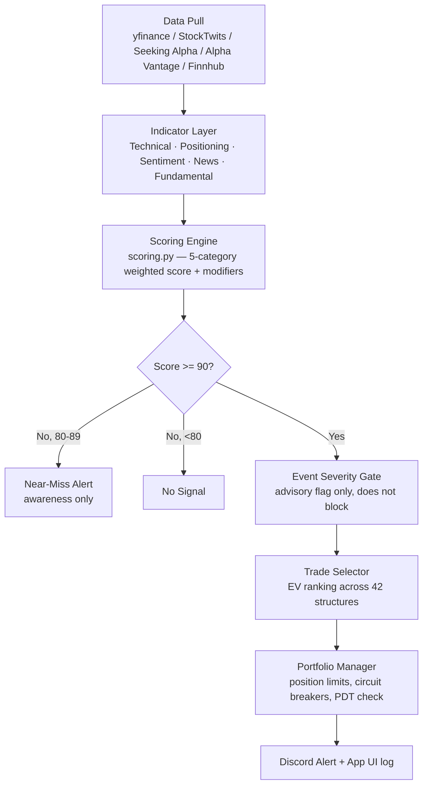

# StockAnalysis — Current Project Overview

**A single, current snapshot of the whole workspace — what it is, how it works, what's built, and where it stands today.**
For the full historical design rationale and every implementation detail, see `Project_Scope.md` (the living spec this document summarizes). For the desktop app plan, see `App_UI_Scope.md`. For a version-by-version history, see `CHANGELOG.md`.

*Last reviewed: 2026-07-19, model v2.2.5 — includes the first real backtest result, a fix to correlated-modifier stacking, a fix to a previously-broken sensitivity-analysis tool, the walk-forward result that fix led to examining, and an adopted (but honestly-conflicted) entry-filter change based on walk-forward-pooled evidence.*

---

## Table of Contents

1. [At a Glance](#1-at-a-glance)
2. [What This Is (and Isn't)](#2-what-this-is-and-isnt)
3. [How It Works](#3-how-it-works)
4. [The Scoring Model](#4-the-scoring-model)
5. [Trade Selection](#5-trade-selection)
6. [Safety & Risk Systems](#6-safety--risk-systems)
7. [Project Structure](#7-project-structure)
8. [Tech Stack & External APIs](#8-tech-stack--external-apis)
9. [Build Status by Phase](#9-build-status-by-phase)
10. [Testing](#10-testing)
11. [Where Things Actually Stand Right Now](#11-where-things-actually-stand-right-now)
12. [Desktop App (In Progress)](#12-desktop-app-in-progress)
13. [Known Gaps & Open Items](#13-known-gaps--open-items)
14. [What's Next](#14-whats-next)
15. [How to Run It](#15-how-to-run-it)

---

## 1. At a Glance

| | |
|---|---|
| **Purpose** | Decision-support system that finds high-conviction swing trades in semiconductor stocks and recommends them — it does not trade automatically |
| **Watchlist** | NVDA, AMD, AVGO, TSM, MU, ASML (benchmark: SMH sector ETF) |
| **Holding period** | 5–15 trading days |
| **Starting capital (paper only)** | $15,000 |
| **Current model version** | v2.2.5 (see `CHANGELOG.md`) |
| **Live-trading status** | ❌ **Not eligible.** No version has ever passed a backtest — and walk-forward validation has never passed in any of 24 six-month windows tested (2014–2026). Zero real money at risk. |
| **Current phase** | Paper trading (running, 0 qualifying signals so far) + post-review code hardening |
| **Test suite** | 500 tests: 497 pass, 3 skipped — the skips are stale, leaving stress testing with zero real coverage (see §10) |
| **Delivery channel** | Discord webhook (sole channel — email/SMS were removed in v2.2.1) |

---

## 2. What This Is (and Isn't)

**It is:** a rules-based, statistically-grounded scoring engine that pulls technical, market-positioning, sentiment, news, and fundamental data for six semiconductor stocks every day, combines it into a single 0–100 confidence score per ticker, and — for anything scoring 90+ — ranks the best of 42 possible trade structures (stock, options, spreads) by expected value and posts a recommendation to Discord.

**It is not:**
- An autonomous trading bot. Nothing executes automatically — every alert requires manual review and manual order entry.
- Financial advice.
- Validated yet. The backtest has never produced a passing result, and paper trading has not accumulated enough history to judge. See [§11](#11-where-things-actually-stand-right-now).

**Non-negotiable gate before any real money is used** (all three required simultaneously):
- 80% win rate
- 90/100 minimum confidence score to surface a trade
- 1:3 minimum risk/reward ratio

---

## 3. How It Works



**Cadence:** the pipeline runs up to three times a day — pre-market (~8:30am ET), mid-session (~12pm ET), and post-close (~4:30pm ET). Technical/Positioning/Sentiment/News refresh on every run; Fundamental data refreshes weekly (Monday) since valuation and earnings data move far slower.

**Two-layer architecture:**
1. **Indicator layer** — pulls raw data and computes every metric with full timestamp precision (`shared/` clients + `swing_model/*_layer.py`).
2. **Decision layer** — combines everything into a confidence score and picks the best trade structure by expected value, not a lookup table (`scoring.py`, `trade_selector.py`).

Everything is transparent and backtestable — z-score normalization, rolling win rates, and explicit formulas throughout, not black-box ML.

---

## 4. The Scoring Model

Five categories sum to a 100-point base score, then modifiers (regime, sector rotation, earnings proximity, cross-ticker correlation, seasonality, macro overlay) adjust it up or down before a final 0–100 clamp.

| Category | Max Points | What It Measures | Source |
|---|---|---|---|
| **Technical** | 40 | Breakout, trend (MA cross), relative strength vs. SMH, RSI, volume profile | yfinance (free) |
| **Market Positioning** | 20 | Options put/call ratio + IV skew, institutional ownership change, short interest trend, insider (Form 4) transactions, analyst rating trend | yfinance (free) |
| **Sentiment** | 15 | StockTwits bullish/bearish ratio + velocity, Seeking Alpha engagement proxy | RapidAPI (**paid**) |
| **News** | 15 | NER-extracted ticker-specific sentiment, source-credibility weighted, time-decayed, narrative-theme aligned | Alpha Vantage + Yahoo + Finnhub (free) |
| **Fundamental** | 10 | Earnings momentum (EPS growth, surprise streak, estimate revisions), valuation vs. sector peers (P/E, EV/EBITDA) | yfinance + Alpha Vantage (free) |

**Modifier layer (applied after the base score):** market regime (trending/choppy/high-vol), sector rotation (SMH vs SPY flow), earnings proximity, cross-ticker divergence, seasonality, and macro overlay (Fed rates, USD strength, China trade policy) — each bounded (e.g. regime ±10/-15, earnings proximity 0/-20) so no single modifier can dominate the score.

**Notable design history:** Reddit/PRAW was the original sentiment source and was fully removed in v2.0.0 (stalled API access, weaker signal than StockTwits' explicit sentiment tags). Insider transactions used to be a separate ±8 modifier; it was folded into Market Positioning to stop double-counting the same SEC filings.

**Event Severity Gate:** a separate binary mechanism (not a scoring category) that watches for breaking news severe enough to outrun the four slower-moving categories (a chip export ban, a CEO resignation, fraud allegations). As of v2.1.1 it is **advisory only** — it flags a candidate with a visible ⚠️ warning rather than suppressing it, so you make the judgment call rather than the system hiding potentially valid signals.

Full formulas, point-by-point sub-signal breakdowns, and a worked example live in `Project_Scope.md` under "Confidence Scoring (Swing)".

---

## 5. Trade Selection

For any ticker scoring 90+, the trade selector doesn't use if/then rules — it computes **Expected Value for all 42 applicable trade structures simultaneously** (long/short stock, calls, puts, LEAPS, debit spreads, credit spreads, collars, calendars, diagonals, and more) and ranks them.

```
EV = (Win Probability × Average Win) − (Loss Probability × Average Loss)
```

Filters applied before a structure can be recommended:
- **1:3 minimum risk/reward** (target distance ≥ 3× stop distance, based on ATR + volume-profile levels)
- **Liquidity/slippage filter** — excluded if slippage would eat ≥50% of raw EV
- **Options approval level** — structures above your configured brokerage permission level are filtered out entirely
- **Greeks filter** — documented but not yet implemented (no live options-chain data feeds it yet); currently surfaced as an explicit "not evaluated" status rather than silently passing

Entry zone, stop, and target are all computed from explicit formulas (ATR + volume-profile nodes) — never eyeballed.

---

## 6. Safety & Risk Systems

The system leans heavily on layered risk controls rather than trusting the score alone:

| System | What it does |
|---|---|
| **Data validation** | Every incoming price/sentiment/news/positioning record is range-checked before use; corrupt tickers are excluded from that scan and logged to `validation_log.csv` |
| **Graceful degradation** | Each of Sentiment's and Positioning's sub-signals can fail independently without zeroing the whole category; full category outage caps confidence at 70 (below the 90 threshold) |
| **Black Swan detector** | Freezes new signals and fires a red alert if SMH drops >7% intraday or VIX spikes >40% |
| **Circuit breakers** | Yellow/Orange/Red drawdown tiers on the $15k paper account |
| **PDT tracking** | Tracks rolling 5-day day-trade count, warns before a forced same-day close would trip the pattern-day-trader rule |
| **Correlated-position limits** | Blocks a second same-direction position on a ticker that already has one open, and limits simultaneous correlated pairs (e.g. NVDA/AMD) |
| **Event Severity Gate** | Advisory flag on trades surfaced during a severe, thesis-opposed breaking-news event (see §4) |
| **Model versioning discipline** | `CHANGELOG.md` + `model_versioning.py` — no scoring/threshold change goes live without a version bump and a backtest entry logged. Every version since v2.0.0 remains marked not-eligible-to-go-live pending a passing backtest |
| **Audit trail** | Every scan decision (score breakdown, modifiers, gate state, whether it surfaced) is written to `audit_log.csv`, regardless of outcome |

---

## 7. Project Structure

```
StockAnalysis/
├── shared/                  Reusable logic: API clients, indicator math, utilities
│   ├── api_clients/         yfinance, StockTwits, Seeking Alpha, Alpha Vantage, Finnhub wrappers
│   ├── indicators/          Technical indicator math (MA, RSI, ATR, MACD, z-scores)
│   └── utils/                20+ modules: risk/reward math, regime detection, sector rotation,
│                             volume profile, earnings calendar, NER, insider tracking, options
│                             math, position sizing, data validation, event gate, seasonality,
│                             macro overlay, Discord alerts, atomic file writes
│
├── swing_model/             The strategy itself: pipeline, 5-category scoring, trade selection,
│                             portfolio/position management, signal decay, feedback loop
│
├── backtesting/             Historical replay engine (70/30 split, walk-forward, stress tests);
│                             entry_filter_variants.py — pools trades across all 24 walk-forward
│                             windows to test entry-filter candidates without overfitting to
│                             the single fixed test slice (added v2.2.5)
│
├── paper_trading/           Forward-testing with real market data, simulated fills, no real capital
│
├── monitoring/               Weekly performance dashboard → Discord
│
├── app_ui/                  Draft PySide6 desktop app (results, alerts feed, config editor) — see §12
│
├── config/                  swing_config.yaml (watchlist, thresholds, weights)
│                             global_config.yaml (API/infra settings)
│
├── data/
│   ├── processed/           Live state: open positions, live weights, event-gate state,
│                             cached fundamental/positioning snapshots, AV call budget counter
│   ├── logs/                 audit_log, override_log, validation_log, fill_log,
│                             trade_outcomes, performance_log (CSV, forensic record of every run)
│   ├── raw/ · historical/    Gitignored API caches
│
├── output/swing_recommendations/   Daily ranked recommendation output
│
├── tests/                   22 test files, 500 tests total
│
├── Project_Scope.md         Full design spec (detailed, ~1,600 lines) — source of truth for "why"
├── App_UI_Scope.md          Desktop app design addendum (draft)
├── CHANGELOG.md             Version history, backtest status per version, versioning rules
└── README.md                Setup/quick-start
```

---

## 8. Tech Stack & External APIs

| API / Library | Used For | Cost |
|---|---|---|
| **yfinance** | OHLCV price data, options chain, institutional holders, short interest, insider transactions, analyst ratings, earnings calendar | Free |
| **StockTwits** (via RapidAPI) | Real-time tagged Bullish/Bearish crowd sentiment | **Paid** (shared `RAPIDAPI_KEY`) |
| **Seeking Alpha Finance** (via RapidAPI) | Engagement proxy (comment count velocity) + editorial news | **Paid** (same key) |
| **Alpha Vantage** | Pre-scored news sentiment, weekly fundamental batch | Free (25 calls/day cap, actively budget-tracked) |
| **Finnhub** | Company news headlines | Free tier |
| **Discord Webhook** | Sole alert delivery channel | Free |
| **spaCy** | Named entity recognition on news headlines (multi-company article disambiguation) | Free/local |
| **py_vollib** | Black-Scholes options pricing/Greeks | Free/local |
| **PySide6** | Desktop app UI framework | Free |
| **SQLite** | Desktop app's local persistence (`stockanalysis_history.db`) | Free/local |
| **pytest / ruff** | Testing and linting | Free/local |

Full core dependency list is in `requirements.txt`.

---

## 9. Build Status by Phase

The project follows a 16-phase roadmap defined in `Project_Scope.md`. Status today:

| Phase | Area | Status |
|---|---|---|
| 1 | Market data + technical indicators foundation | ✅ Built |
| 2 | Technical indicator pipeline | ✅ Built |
| 3 | Macro context layer (regime, sector rotation, earnings calendar, seasonality, macro overlay) | ✅ Built |
| 4 | Positioning, Sentiment, News, Fundamental layers | ✅ Built |
| 5 | Volume profile + cross-ticker analysis | ✅ Built |
| 6 | Confidence scoring engine | ✅ Built |
| 7 | EV-based trade selector (42 structures) | ✅ Built |
| 8 | Signal decay + portfolio management | ✅ Built |
| 9 | Risk mitigation layer (validation, Black Swan detector, fallbacks) | ✅ Built |
| 10 | Discord alerts + notification routing | ✅ Built |
| 11 | Model versioning + CHANGELOG enforcement | ✅ Built |
| 12 | Backtesting engine | ✅ Built, **but no version has ever produced a passing result; stress-test suite has zero real test coverage (see §10)** |
| 13 | Paper trading | 🔄 **Running now** — 0 qualifying signals logged so far |
| 14 | Feedback loop + performance monitoring | ✅ Built (dashboard + calibration exist; calibration not yet applied live) |
| 15 | Live execution | 🔒 Blocked — cannot start until Phase 13 passes |
| 16 | Continuous improvement | Ongoing |

Additionally, a **desktop app UI** (not in the original 16-phase roadmap) is under active draft development — see §12.

---

## 10. Testing

- **500 tests** across 22 files in `tests/` — **497 pass, 3 are skipped.** Covers scoring, every indicator layer, the event gate, position sizing/trade math, portfolio management, backtesting, paper trading, feedback loop/calibration, and the app UI's config validation, database layer, and scan worker.
- **The 3 skips are stale, not conditional.** All three live in `tests/test_stress_scenarios.py` and are hardcoded `pytest.skip("Implement Phase 12 first")` — but Phase 12 (backtesting) is done, and `backtesting/stress_test.py` itself is fully implemented (`SCENARIOS`, `run_all_scenarios`, `run_scenario`). The skip messages were never updated after that landed, so **stress testing currently has zero real test coverage** despite the module existing and being wired into the roadmap as built.
- Tests verify code correctness (the logic does what it's supposed to) — they do **not** verify the strategy is profitable. That's what backtesting and paper trading are for, and both remain unproven (see below).

---

## 11. Where Things Actually Stand Right Now

This is the part a design spec doesn't tell you — the actual operational state as of 2026-07-19:

- **No real money has ever been at risk.** Paper account equity sits untouched at $15,000, zero open positions.
- **Paper trading is live but quiet.** The most recent real scan (2026-07-17) scored all six tickers in the 20–35/100 range — well under the 90 threshold — driven mainly by negative regime and sector-rotation modifiers (semiconductors were in an outflow/choppy read that week). Zero trades have been logged to the paper trading dataset yet.
- **The backtest has been re-run several times against v2.2.2-v2.2.5 (2026-07-19).** The original (RSI 45-82) fixed-slice result: win rate 57.0% (need 80%), avg R:R 2.01 (need ≥1:3), 107 qualifying trades, Sharpe 2.45 (confirming the previously-reported 9.1 figure really was inflated by an equity-curve/annualization bug fixed in v2.2.2). **After the v2.2.5 RSI-tightening change (see below), the same fixed slice now reads 51.8% WR, avg R:R 2.23, only 27 qualifying trades — below the project's own 100-trade minimum.** Both numbers are documented; see the tension explained below.
- **Regime coverage isn't a data problem — it's structural, and more history won't fix it.** Broke the full signal set down by regime: `trending_up` candidates average confidence ~91, `high_vol` candidates (77 of them, real breakouts that occurred during volatile stretches) average only ~63 — **every single one** blocked by a deliberate `high_vol_score_cap: 70` safety brake — and `trending_down` produces zero candidates *by construction* (the entry filter requires `trend_intact`, which a downtrend can't satisfy). This strategy shape can only ever qualify signals in `trending_up`; the project's own "80% win rate in all four regimes independently" requirement (Project_Scope.md → Performance Thresholds) is unsatisfiable as written for this design, not a gap a longer historical window closes.
- **The sensitivity-analysis tool (`--sensitivity`) was completely broken and has been fixed (v2.2.4).** A config-key mismatch meant it silently returned all zeros at every threshold since it was written. Original finding: win rate was roughly flat (56.8%-60.5%) across thresholds 85-95 — raising the threshold alone wasn't closing the gap to 80%. (Regenerated after v2.2.5's RSI change — see `backtesting/reports/sensitivity_analysis.csv` for current numbers; signal frequency at threshold 90 is now far lower, ~0.55/month vs. the original ~2.19/month.)
- **Walk-forward validation — which the project already computes on every backtest run and had never actually been looked at — has never passed. Not once, in any of 24 six-month windows from 2014 to 2026.** (Pass bar: win rate ≥70%, avg R:R ≥1.8, ≥10 trades per window.) Most windows have far too few qualifying trades to be individually meaningful, and win rate swings wildly window to window. This was the trigger for building a proper walk-forward-pooled evaluation harness rather than continuing to tune against the single fixed slice.
- **`backtesting/entry_filter_variants.py` (new, v2.2.5): pools qualifying trades across all 24 walk-forward windows to test entry-filter candidates honestly**, instead of hand-tuning against the one fixed test slice (the exact overfitting trap a volume-confirmation experiment fell into and was deliberately reverted from in v2.2.4). Five variants tested — results in `CHANGELOG.md` v2.2.5. **RSI ceiling tightened from 82 to 70 was adopted as the new backtest default**, based on a robust pooled improvement (49.4%→60.8% win rate across all 24 windows) — but seeing an "expert stock analyst" framing helped identify it: extended moves (RSI 70-82) have less runway left before a 3R target, consistent with the earlier finding that 41% of qualifying trades stall around 0.88R when the 15-day time stop hits, rather than failing fast. **This is a backtest-methodology change only** — live/paper scoring already scores RSI continuously (0-8 points, no hard cutoff, `swing_model/scoring.py`) and is untouched by it.
- **The RSI change created a real, documented tension worth understanding, not hiding:** on the pooled 24-window sample it's a clear improvement, but on the *specific* fixed 2022-2026 slice used for the "official" headline number, it makes things *worse* (57.0%→51.8% WR) and shrinks the sample below the 100-trade minimum (107→27). Adopted anyway, on the reasoning that 207 pooled trades across 24 independent periods is statistically sturdier than 27 trades on one slice — but this is a judgment call under real uncertainty, not a clean win, and it's logged as such in `CHANGELOG.md` v2.2.5.
- **A volume-confirmation entry filter and a next-bar-confirmation filter were also tested via the same pooled-window harness.** Volume confirmation (`breakout_volume_zscore ≥ 0.5`) also improved pooled win rate (55.8%) with more retained sample (104 trades) — a reasonable next candidate. Next-bar confirmation did **not** help (49.1%, roughly flat) — consistent with losses resolving over 5-9 days rather than 1-2, so a simple one-bar check doesn't catch the real failure pattern. An RSI+volume combo showed the best pooled number (71.9%) but on only 32 trades — flagged as promising, not yet adopted, too thin to trust.
- **A separate problem, found while investigating why paper trading had produced zero signals: `regime`, `sector_rotation`, and `cross_ticker` were stacking to a uniform -24 penalty across the whole watchlist**, all three substantially derived from the same underlying SMH sector trend. A config/code key mismatch in `cross_ticker_analysis.py` also meant a configured `-10` sector-wide value was silently ignored in favor of a hardcoded `-5.0`. **Fixed in v2.2.3**: key mismatch corrected, `sector_wide_discount` now `0`. Not modeled in the backtest at all, so doesn't affect any backtest number above — only live/paper scoring. Full detail in `CHANGELOG.md` v2.2.3.
- **On the original economics, for context:** 57.0% win rate × 2.01 avg R:R worked out to roughly **+0.72R expected value per trade** — directionally positive-EV, just short of the project's strict 80%/1:3 double-bar. Worth a separate conversation about whether that bar itself is right, independent of everything else found this session.
- **Every version from v2.0.0 through v2.2.5 remains formally "not eligible to go live"** per the project's own CHANGELOG rule.
- **Next concrete action:** re-validate the volume-confirmation filter and the RSI+volume combo with more rigor (larger pooled samples as more historical data becomes available), and decide whether the entry filter needs further work or whether it's time to accept this breakout-only design has a real, bounded ceiling and consider a genuinely different signal type for regimes it structurally can't trade. Meanwhile watch daily paper trading — base category scores (roughly 50-57/100 before modifiers, per the 2026-07-17 log) are still well short of 90 on their own, and signal frequency will now be even lower than before given the tightened backtest filter's implications for how rare a "real" qualifying setup is.

---

## 12. Desktop App (In Progress)

A local PySide6 desktop app is being built alongside the existing Discord-only pipeline — **additive only**, it changes no scoring logic or config format.

- **Purpose:** view results, per-ticker layer breakdowns, and the full alert history without leaving the app, persisted across sessions in SQLite (`stockanalysis_history.db`).
- **Screens (per `App_UI_Scope.md`):** Results (grouped by Trade Recommended / Passed-No-Trade / Near-Miss / No Signal, expandable to layer breakdown), Notifications feed, Config editor (writes back to `swing_config.yaml` with validation), Run Control (fires `paper_runner.py`, with an Alpha Vantage budget guard before running and a hard-disabled button during a run to prevent concurrent writes to shared state files).
- **Status:** scaffolded (`app_ui/` has `main.py`, `main_window.py`, `results_tab.py`, `config_tab.py`, `notifications_tab.py`, `scan_worker.py`, `db.py`), with dedicated test coverage already in `tests/test_app_ui_*.py`. `App_UI_Scope.md` itself is still marked **draft, not yet merged into `Project_Scope.md`**.
- **Open design decision noted in the spec but not yet resolved in code:** whether the ~7 separate Discord-alert call sites get consolidated into one shared `build_notification()` step, or the UI's DB write is bolted on next to each existing call site individually. The spec recommends starting with the lower-risk "bolt-on" approach.

---

## 13. Known Gaps & Open Items

- **Backtest fails, and walk-forward has never passed in any of 24 windows tested (2014-2026).** Regime coverage outside `trending_up` is structurally unreachable for this entry-filter design, not a data gap. The v2.2.5 RSI-tightening change improved the pooled 24-window result but made the fixed-slice headline number worse — see §11 for the full, honestly-conflicted picture. See `CHANGELOG.md` v2.2.2/v2.2.4/v2.2.5. This is the single most important open item — more important than any single threshold or filter tweak.
- **The RSI+volume combo and volume-only entry filters (`backtesting/entry_filter_variants.py`) look promising but aren't adopted yet** — 32 and 104 pooled trades respectively, both thinner samples than ideal for a confident decision. Revisit as more historical/paper data accumulates.
- **Options Greeks filter (theta/vega/gamma)** in the trade selector is documented but not implemented — no live options-chain data currently feeds it. Surfaced honestly as "not evaluated" rather than silently passing.
- **Signal decay re-scoring** (`rescore_open_positions()`) is implemented and tested but **not wired into the live daily loop** — it would let the system start closing positions automatically without a human review pass, which hasn't been decided on yet.
- **Calibrated live weights** (`live_weights.json` / feedback loop calibration) exist and are tested, but nothing currently calls `compute_confidence_score()` with `live_weights` populated — the model is still running on its original hypothesis weights, not empirically calibrated ones.
- **Market Positioning and Sentiment have no real historical data yet** — both StockTwits data and most Positioning sub-signals only started accumulating from v2.0.0 onward, so the backtest engine still uses neutral/proxy inputs for those two categories. This is expected to improve as more real history accumulates, not a bug to fix.
- **The backtest doesn't model `cross_ticker` at all** (hardcoded to `0.0` in `backtest_engine.py`) — so the v2.2.3 modifier-stacking fix (§11) can't be validated by backtest replay, only by direct log inspection, and any future cross_ticker tuning will need the same treatment.
- **Stress testing (`backtesting/stress_test.py`) has zero real test coverage.** The module is fully implemented, but all 3 tests in `tests/test_stress_scenarios.py` are hardcoded to skip with a stale "Implement Phase 12 first" message that was never removed once Phase 12 landed — see §10.
- **App UI is still a draft** — scaffolded and tested in isolation, not yet confirmed end-to-end against a live paper-trading run.

---

## 14. What's Next

1. **Re-evaluate the volume-confirmation filter and the RSI+volume combo** using `backtesting/entry_filter_variants.py` as more historical/paper data accumulates — both showed real promise (55.8% and 71.9% pooled win rate respectively) but on samples too thin (104 and 32 trades) to commit to yet.
2. **Decide what to do about the walk-forward result more broadly.** 0 of 24 six-month windows have ever passed. This is a strategic call, not a code fix: either the entry signal needs further fundamental rework beyond the RSI change already made, or the sample-size problem (too few trades per window) means the model needs more real-world time before any single number — pooled or fixed-slice — can be fully trusted.
3. **Decide on the regime-coverage requirement.** Structurally unreachable for a breakout-style entry filter (§11) — either redefine it (validate `trending_up` directly, validate abstention elsewhere) or treat it as a signal this design needs a second, different signal type for non-trending regimes.
4. Let paper trading keep accumulating real signals in parallel — no meaningful forward-test conclusion is possible yet at 0 logged trades, and expect it to be even slower now given the tightened backtest filter implies genuinely rare qualifying setups.
5. Decide on the `build_notification()` consolidation question for the desktop app (§12) before it grows more alert-consuming call sites.
6. Once enough paper-trading history exists, run `feedback_loop.run_calibration()` and decide whether to switch scoring over to calibrated live weights.
7. Continue treating every scoring/threshold change as a version bump with a required backtest entry — no exceptions, per the project's own rule (already followed for the RSI change in v2.2.5).

---

## 15. How to Run It

```bash
# One-time setup
pip install -r requirements.txt
python -m spacy download en_core_web_sm
cp .env.example .env        # fill in API keys — see §8

# Daily paper-trading scan (the actual current operational pathway)
python paper_trading/paper_runner.py

# Full historical backtest (run as a module, not a script path — plain
# `python backtesting/run_backtest.py` fails with ModuleNotFoundError)
python -m backtesting.run_backtest

# Threshold sensitivity analysis only
python -m backtesting.run_backtest --sensitivity

# Compare entry-filter candidates, pooled across all 24 walk-forward windows
python -m backtesting.entry_filter_variants

# Stress test against extreme scenarios
python backtesting/stress_test.py

# Weekly performance dashboard → Discord
python monitoring/performance_dashboard.py

# Desktop app (draft)
python app_ui/main.py
```

Note: `run_swing_model.py` (the "real" live-signal entry point) exists and is fully built, but the actual pathway run daily right now is `paper_trading/paper_runner.py` — no version is eligible to go live yet.

---

*This document is a snapshot, not a source of truth for implementation details — those live in the code and in `Project_Scope.md`. Regenerate or update this file whenever the version, phase status, or operational picture materially changes.*
